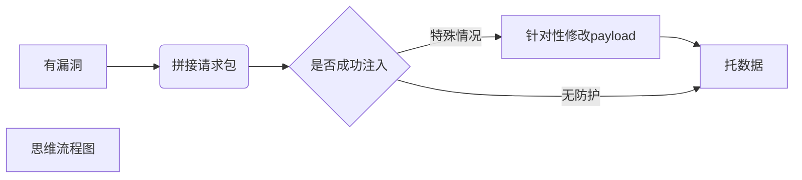

# TQ sqlmap一把梭大法 

> sqlmap -u "url" 
# ***思维***


## 拼接请求包
```shell
-u "url"
-p "参数"
-r "http请求包文件"
-m "url文件"
--data=DATA #拼接body
--cookie=COOKIE # 仅拼接cookie不能测payload
--mobile #  拼接移动端ua
--random-agent # 随机ua
--proxy=PROXY # 挂代理
```
---
## 控制payload
```shell
--dbms=DBMS # 设置数据库类型，记不住名字可以--dbms="1"
--prefix=PREFIX # 在payload前加东西
--suffix=SUFFIX # 在payload后加东西
--technique=TECHNIQUE # 注入类型“B:布尔，E：显注，U：union,S:stacked,T：时间注入，Q:query lnline”
--batch # 自动输入y
--level=LEVEL # 测试等级1-5，注意脏数据
--risk=RISK # payload危害性1-3
--second-url=URL #结果重定向到指定的URL
--chunked # 将post请求包拆分绕过防护
--hpp # hpp攻击,绕墙
--tamper=TAMPER # 使用指定脚本绕过防护，目录/usr/share/sqlmap/tamper
```
---
## 脱数据
```shell
--is-dba # 返回是不是用户数据库管理员
--dbs   # 返回数据库
--current-user # 返回当前用户
--current-db # 返回当前所在数据库
-D -T -C --dump # 托全部数据
```
---
## 控制访问
```shell
--os-shell # 拿系统权限
--delay=DELAY # 延迟发包针对破服务器
--timeout=TIMEOUT # 设置连接延迟时间默认30s
--time-sec=TIMESEC # 设置接收响应的延迟默认5s
```

